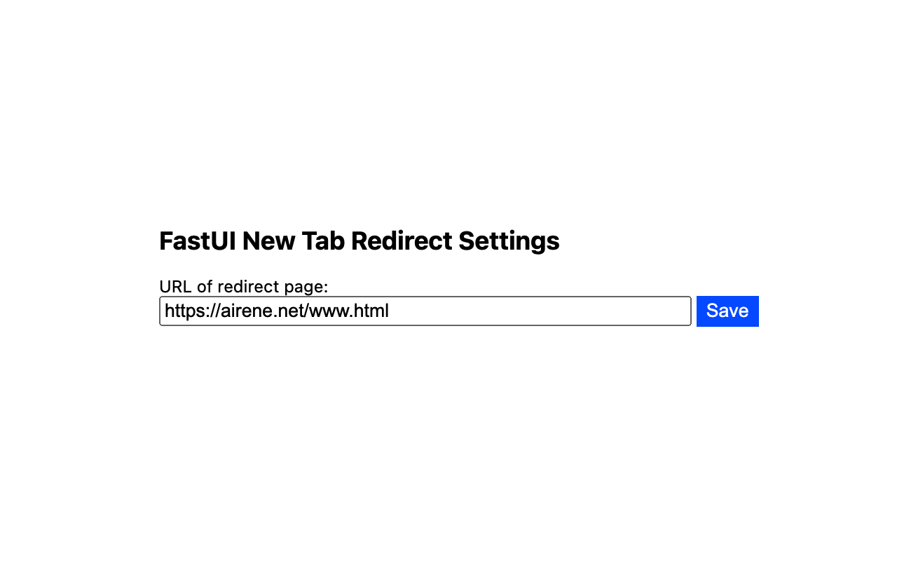

# 用上自己的 chrome 插件 FastUI new tab
功能非常简单，就是新建tab时候重定向到自己的一个url，这个url是非常常见的一个网址集合。 或者自己设计的页面，或者是常见的开源的网址导航。  

之前用的一个特别轻量的插件一直是用的ver2版本的标准做的，已经不维护了，而且还有一个问题，就是所有窗口都关了，新开tab是一个空页面。 **用v3版本实现机制也不一样。**   

回馈社区： 自己注册一个开发者账号，$5的认证费用，不是交易型的开发者相对比较简单。  

现在已经通过审核且上架了，欢迎品尝：

https://chromewebstore.google.com/detail/fastui-new-tab/nkmjfiapcldjjoklffalliaoldmfmpdk  
https://github.com/vfastui/newtab
