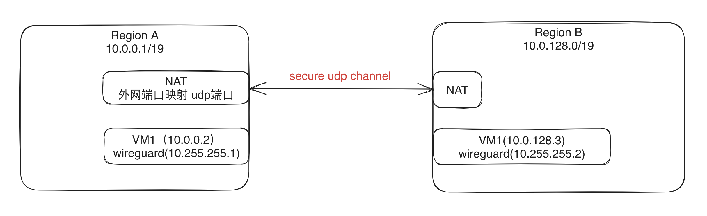

# 云厂商不同region之间的wireguard LAN to LAN模式

## 前提
本文的环境和条件：
 - 有NAT网关作为出口流量
 - 至少要有一个NAT要做公网端口映射，或者从LB有一个映射也可以，本文是NAT上映射

## 架构图

## 实操
1、NAT开启端口映射（教程就开默认端口了，生产自己定），假设开在10.0.0.1/19这个VPC里，那就是DNAT `NAT:51820 -> 10.0.0.2:51820`  
2、路由表两个VPC都要增加：A: 10.0.128.0/19 下一跳 10.0.0.2；B: 10.0.0.0/19 下一跳 10.0.128.3  
3、allowedips，以10.255.255.1这个节点为例，peer的ip是10.255.255.2 allowedips应为: 10.255.255.1/32,10.0.128.0/19  
4、节点启动脚本有MASQUERADE的内容 `PostUp=iptables -A FORWARD -i %i -j ACCEPT; iptables -A FORWARD -o %i -j ACCEPT;iptables -t nat -A POSTROUTING -o eth0 -j MASQUERADE`
5、**作为wireguard的节点需要开机ip forward，也就是转发功能 `/etc/sysctl.conf`中的 `net.ipv4.ip_forward = 1`**
6、条件还是有些多的，以上都准备好，服务起来基本就通了
