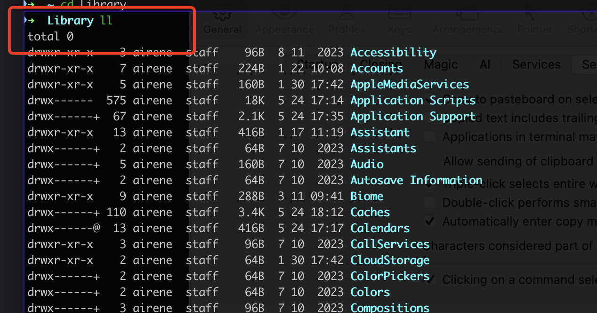

# iterm2 3.5.0 更新之后 单击某个命令的输出会出现蓝色框

只有3.5.0+才有此选项，才有此问题，看起来是为了**增强查找和过滤**，我用不到，而且感觉很别扭。
表现：

解决办法也很简单，关掉下面的选项即可  
General / Selection uncheck the option "Clicking on a command selects it to restrict Find and Filter"  

另外看到一个我觉得很有意思的文摘

> **CEO的三封信**  
> 一家陷入困境的公司，聘请了一位新的 CEO。  
> 即将卸任的前 CEO 私下会见了他，并向他赠送了三个有编号的信封。"如果你遇到了重大麻烦，请打开这些信封，每次只能打开一个。"前 CEO 说。  
> 三个月过去了，公司的销售额和利润仍然在大幅下降，新任 CEO 受到了很大的压力。  
> 他开始惊慌，但随后他想起了那些信封。他从抽屉里拿出第一个信封，上面写着："责怪你的前任。"  
> 新任 CEO 就召开新闻发布会并解释说，前任给他留下了烂摊子，清理它的时间比预期要长，但一切都在正确的轨道上。媒体和华尔街对他的解释感到满意，做出了积极回应。  
> 又一个季度过去了，公司仍在苦苦挣扎。吸取了之前的经验，他就打开了第二个信封，上面写着："重组。" 因此，他解雇了员工，整合了部门，尽可能地削减成本，华尔街和媒体都对他的努力表示赞赏。  
> 三个月过去了，公司的销售额和利润仍然裹足不前。他在财报电话会议前，走进办公室，关上门，打开第三个信封，上面写着："准备三个信封。"  

出处：https://www.ruanyifeng.com/blog/2024/05/weekly-issue-301.html

