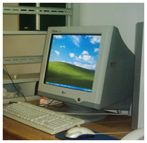
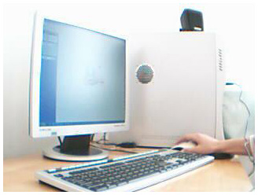
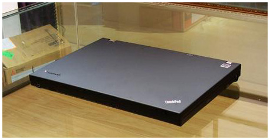

# 我的每一台电脑
2003年大一下学期的时候购的人生第一台电脑。4.3K
CPU  P4 2.4G 内存 256M  显卡128M 硬盘 80G 显示器 LG CRT

  
图片差点都不可考了，后来卖给了一个老乡，然后又帮老乡卖给了一个校友。
2006年买的人生的第二个电脑，大三开学的时候，那个时候刚做一个网络的兼职挣了2K块钱，就想着怎么能提高效率，卖了旧的3K，又另外向家里人要了点 7.4K 买的。
CPU  P4 3.0G 内存 1G  显卡128M 硬盘 160G 显示器 SAMSUNG LCD。

第二个算是比较超值，做了一年的兼职，最终因为保养的还不错，换了一个主机外壳邮寄回家给小弟当游戏机用了。
2009年7月 买了人生的第三个电脑 ThinkPad T400，以前不喜欢笔记本，嫌慢，科学的发展使二者的区别越来越小了，静音也是我考虑的一个重要原因。8.3K
CPU  P8700 2.53G 双核 内存 4G  显卡 256M 硬盘 320G

能让其物有所值就好。 学java,学运营。投资。

2013年买了个macbook air 7000 没接触过系统 玩玩mac,买了大部分时间闲置

2014年底12月25日 把air 卖了 买个2014年 macbook pro 的顶配 14000

2019年6月 mbp2014卖了5000 买了一个mbp2019 15寸低配
