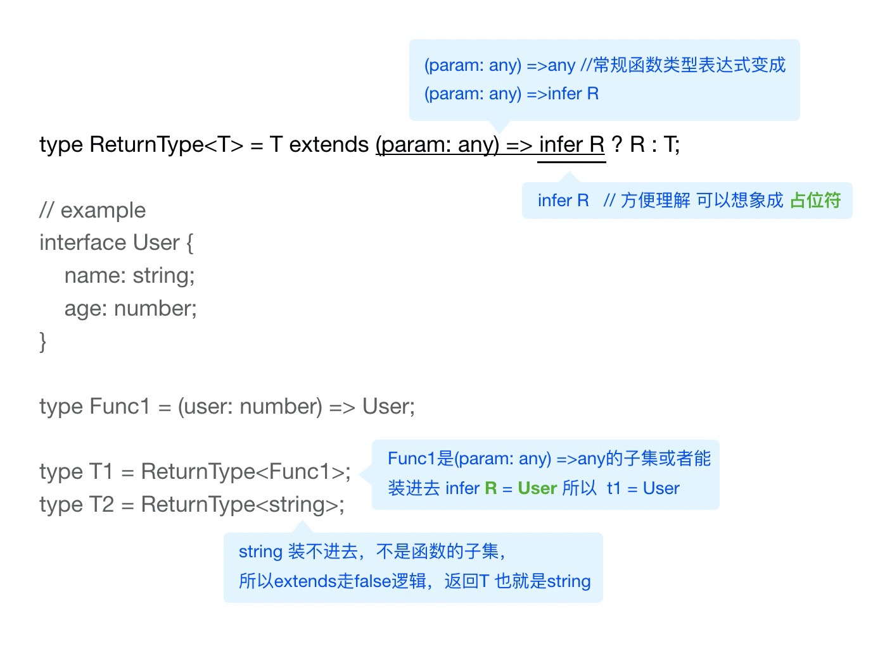

# {{ $frontmatter.title }}

## 前提条件 & 理解关键
- `infer` 在类型计算或者推导的时候使用
- 需要结合`extends`，`extends`很好理解，就是**是否是子集**
- `infer`只能出现在`extends`为`true`的分支

## extends
```ts
// 如果A是B的子集 则T1为类型X，否则类型为Y
type T1 = A extends B ? X:Y
```

## 两个例子
只是为了举例，不是完整的官方类型工具类的代码
```ts
type ReturnType<T> = T extends (param: any) => infer R ? R : T;
type ParamsType<T> = T extends (param: infer P) => any ? P : T;

interface User {
  name: string;
  age: number;
}
type Func1 = (user: number) => User;
type T1 = ReturnType<Func1>; // T1 = User 
type T2 = ReturnType<string>; // T2= string string不是函数的子集，推导失败,返回本身

```

## 一张图来加深说明



## 拓展加强
里面的的UnwrapRef的历史版本真的是吓尿了，ts=类型编程不是盖的  
[理解vue3的UnwrapRef需要多少知识](https://juejin.cn/post/6844904126283776014)


<Comment />
